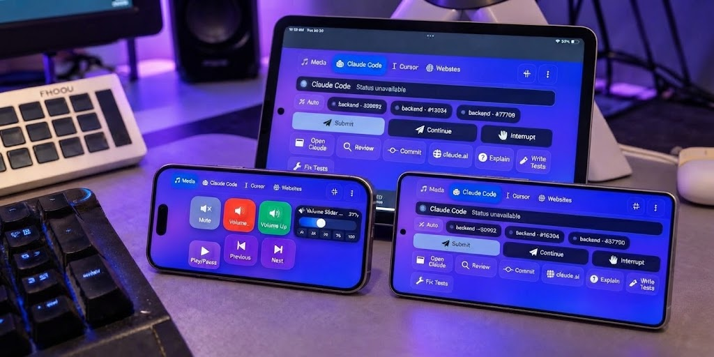

<div align="center">


### A development companion for any screen you already own.

**VDock sits next to your editor and keeps your AI agents, your repo and your day moving. It tells you the moment Claude Code or Cursor needs you, and lets you approve, prompt, review, test and ship from one tap, on a touch panel, a tablet, your phone or a browser tab. Free, open source, and 100% local.**

https://github.com/user-attachments/assets/fd467aec-f5a0-4614-b37c-757e29974d23

<sub>Click the preview to watch the full video</sub>

[](LICENSE)
[](https://github.com/ponya5/VDock/releases/latest)
[](#quick-start)
[](frontend/)
[](backend/)
[](#contributing)

[Quick start](#quick-start) | [A day with VDock](#a-day-with-vdock) | [Agents](#built-for-ai-coding-agents) | [Any screen](#phone-and-tablet-as-the-touch-screen) | [Security](#security-and-privacy) | [Screensaver](#the-screensaver) | [Docs](docs/) | [Issues](https://github.com/ponya5/VDock/issues)

</div>

---

## What is VDock?

Coding with AI agents changed the job. You start a session, the agent works, and then it **waits** for a permission, an answer, a "continue". Meanwhile you're in another window, the build is red, a PR needs a look, and you only find out ten minutes later.

**VDock is built for that loop.** It's a deck of on-screen buttons and live status tiles that runs beside your editor on any spare screen: a cheap USB touch panel, an old tablet, your phone, or just a browser tab. It watches your agents through their official hooks, knows your repo, and turns the things you do fifty times a day into one tap.

<div align="center">

<br /><em>A 7-inch panel above the keyboard. No vendor hardware, no account, no subscription.</em>
</div>

- **It knows when your agent needs you.** Claude Code, Cursor, Copilot, Codex, Devin and more report their state to VDock. The moment one stops to ask, a branded alert appears on the deck and on your phone.
- **It talks back.** Approve or deny, send a preset prompt ("Continue", "Write tests", "Fix this error"), run a slash command, compact or resume a session. Input goes straight into your *live* session, not a new one.
- **It knows your repo.** Branch, changed files, diffs, test runs, dev servers, Docker, PRs, issues and CI checks as live buttons.
- **It's still a full stream deck.** 79 built-in actions (apps, hotkeys, media, system, webhooks, sliders), plus up to 160 more detected from the tools on your machine, for **239 on a typical developer install**.

---

## A day with VDock

| When | What VDock does for you |
|---|---|
| **Start of day** | One tap opens your editor and resumes yesterday's Claude Code session. Live tiles show your branch and the dev servers that are up. |
| **Agent at work** | **Mission Control** lists every session: working, waiting, done. A green dot on the scene tab confirms VDock sees the live process. |
| **Agent waits** | A full-screen alert (Claude, Cursor, Copilot, Devin, etc.) appears over the deck and the screensaver. **Approve / Deny** from the deck or your phone. |
| **Keep it moving** | **Agent Prompt** presets, **Dictate to Agent** (hold, speak, review, submit) and slash-command keys, sent to the session that's ready. |
| **Review** | **Review Changes** lists what the agent touched this turn. Tap a file for its diff. **Run Tests** detects your test command and shows pass / fail. |
| **Ship** | Commit, push, open a PR and watch **CI checks** turn green with `gh`-powered buttons and live badges. |
| **Meetings** | A real Windows **mic mute** with a LIVE / MUTED face, camera, push-to-talk and a volume slider. |
| **Away from desk** | Your phone becomes an approval remote. When idle, the panel turns into an ambient dashboard: clock, weather, headlines, markets, or a music visualizer. |

---

## A dashboard you design


Every scene is a grid you lay out yourself: any size, any mix of buttons, sliders and live widgets. You then control how it looks: a **living background** (54 animated options, 5 gradients, or your own image, set globally, per scene, or per app), **see-through keys** (transparency up to 90%, capped so buttons never disappear), **ten key designs** with 16 overlay effects on top, **virtual sliders** for volume and brightness, and **three dashboard fonts**.


*Same scene with every key switched to the Deck Key design.*

### Add any action, anywhere


Tap the pencil to enter edit mode. Tap an empty cell's **+** to search every action or browse by category. Every key gets **remove / edit / duplicate** badges, and you can **drag to reorder** with a mouse or a finger, resize a slider across cells or merge two into one, set the grid, add pages, or fill the **docked sidebar** with keys that stay put everywhere.

Start from any of the **36 app templates** or import a scene pack someone shared. Every change saves itself.

---

## Built for AI coding agents


**Mission Control** lists every agent session, showing which one needs you and which is working, and lets you approve, deny or jump into it. When an agent stops to ask, a **branded alert** (Claude, Cursor, Copilot, Devin, etc.) appears over the deck and the screensaver.


New in 2.3, each a button you can add from the action picker:

- **Agent Prompt**: send a preset (Continue, Write tests, etc.) or your own text to the ready session
- **Review Changes**: the files the agent changed this turn, with a diff one tap away
- **Run Tests**: detects your repo's test command and shows pass / fail
- **Agent Usage**: today's estimated spend and tokens, as a chip
- **Git Branch**, **Dev Servers**, **Docker**: live status faces with a tap menu (pull/push/stash, open/restart/stop, start/stop/logs)
- **Mic Mute**: a real Windows microphone mute with a LIVE / MUTED face
- **Dictate to Agent**: hold to speak via Windows voice typing, release, review, then submit yourself

Keystroke actions only fire when the target app is focused.

---

## Settings


Settings opens on **Overview**: what's set up, what needs attention, and the switches you reach for most. Five sections sit underneath:

- **Appearance**: key size, transparency and design, backgrounds, fonts, docked sidebar, the [screensaver](#the-screensaver)
- **Agents & automation**: agent alerts and hooks (install or remove each agent's hook, and only VDock's own entry is touched), auto scene switching, triggers, the MCP server
- **Integrations**: **Accounts & keys** and one-tap app templates (ChatGPT, Claude, Cursor, Figma, n8n, etc.)
- **Devices & network**: Connect a device, deck password, ports and host
- **System**: logs (exportable), startup, About


**Accounts & keys** shows which keys and CLIs are configured and what each unlocks. Paste a key into **Set key** and it is saved to the `.env` file on the PC and active immediately. Keys are only accepted from the PC itself, never shown again, and never sent to other devices (you can still edit the `.env` file by hand under **Advanced**). **Find a setting** jumps to any control, **Reset section** restores one page, and changes **save as you make them**.

---

## Phone and tablet as the touch screen

<div align="center">

<br /><em>Media on one phone, Claude Code on a phone and a tablet. It's the same VDock, scanned from the same QR code.</em>
</div>

**No touchscreen? You probably already own one.** Any phone or tablet on your Wi-Fi becomes a deck, or you can keep VDock in a browser tab or its desktop window and click. No app store, no account. It's the same VDock, served from your PC.

- **Phone = a remote.** Portrait layout, safe-area aware, with a Claude Code console and a **phone approval remote**: Approve / Deny a waiting agent from the couch.
- **Tablet = a full deck.** Portrait and landscape grids that fit the screen, with [edit mode](docs/assets/screens/tablet-edit.jpg) (rearrange keys on the tablet itself), and the screen stays awake while the deck is open.
- **Stays connected.** A reconnect banner appears only if the PC is really unreachable, the deck resumes on the right scene when the phone wakes, and edits on one device show up on the others.
- **Install as an app.** Add it to the Home Screen for a full-screen deck with no browser bars.


**Connect in three steps:** get both devices on the same **Wi-Fi**, go to **Settings > Devices & network > Connect a device** and turn on **Allow LAN access** (relaunch once), then **scan the QR code**. With a deck password set, the QR carries a single-use pairing token (valid for 10 minutes), so the phone signs in by scanning.

> **Security:** LAN access is off by default. Anyone on your Wi-Fi who can reach the deck can press your keys and answer your agents, so **set a deck password before turning on LAN access** (Connect page, same screen). Allow the Windows firewall prompt for `python.exe` the first time. See [SECURITY.md](SECURITY.md).

---

## The screensaver


When the deck is idle it turns into an ambient dashboard: a large **clock**, **weather**, rotating **news** and **sports** headlines from free RSS feeds, live **stock/crypto** quotes, and **world clocks**, all with **no API keys required**.

You can also pick the **music visualizer**: 16 animated spectrum skins, from classic Winamp bars to 3D wave grids and a neon fly-through, reacting to whatever is playing on the PC. Shuffle mode crossfades between skins on a timer, and you can layer the widgets on top.


Toggle each widget and open its **Options** for feeds, tickers or cities. **Customise layout** opens a live drag-and-resize editor with snap guides. The idle delay (off to 10 minutes) has its own **Test** button, and the screensaver gets its own background and a text size from 80% to 250%. If Claude Code needs you while the screensaver is up, the amber attention alert appears on top of it.

---

## Security and privacy

VDock can press keys and type into your terminal, so trust matters. The main reason it is safe to use is that **everything runs on your own machine**.

### Why running locally matters

- **Your data never leaves your PC.** There is no VDock cloud, so there is no server of ours that could be breached, and no copy of your prompts, repo details or session activity stored anywhere else.
- **No account, no telemetry.** Nothing to sign up for, nothing to leak, and no analytics reporting how you work.
- **A small attack surface.** With no relay service, the only thing to secure is the app on your PC. LAN access is off by default, so out of the box nothing is reachable from outside the machine.
- **You control the network boundary.** If you want to use a phone or tablet, you choose to enable LAN access, and traffic stays on your own Wi-Fi. You can leave it off and use VDock on the PC alone.
- **It keeps working offline.** The deck, agent alerts and repo actions do not depend on an internet connection or on a vendor staying in business. Only the optional screensaver feeds need the network.
- **Nothing to trust blindly.** The code is open source (MIT), so you can read exactly what it does and what it sends.

### What this looks like in practice

- **100% local.** The server runs on your PC and your phone or tablet talks to it over your own Wi-Fi. No cloud relay, no account, no telemetry or analytics.
- **Agents report in, locally.** Claude Code, Cursor and the other agents use their official hooks to post state to VDock's localhost-only endpoint. Install or remove each hook from Settings. Only VDock's own entry is touched.
- **Your keys stay on the PC.** API keys and tokens live in a local `.env`, are accepted only from the PC itself, are never shown again or sent to other devices, and are stripped from logs and notifications.
- **Locked down by default.** LAN access is off until you turn it on. When you set a deck password, the QR code carries a single-use, 10-minute pairing token. Keystroke actions only fire when the target app is focused.
- **Open source, MIT.** Startup refuses unsafe combinations (debug on the network, SSL without certificates, an example password). See [SECURITY.md](SECURITY.md).

The only outbound calls are the ones you switch on: weather, headlines and quotes for the screensaver, and GitHub when you add a token.

---

## Why VDock

VDock is free and MIT-licensed (Elgato's virtual deck needs their hardware, and Touch Portal's free tier is capped), runs on **Windows, macOS and Linux**, and works on **any screen**: touch panel, tablet, phone or browser. It adds **agent-native actions and agent-waiting alerts** for Claude Code, Cursor, Copilot, Codex, Devin, VS Code and JetBrains. Beyond development it covers calls and recording (mic mute, camera, push-to-talk, OBS), anything with an HTTP endpoint (Home Assistant, n8n, Zapier, webhooks), and kiosk or workshop panels.

<details>
<summary><strong>Using a touchscreen as a second monitor (Windows)</strong>: fixing touch landing on the wrong screen</summary>

Windows will often route every tap to your *primary* display instead of a spare touchscreen monitor. Fix it in two steps:

1. Open **Tablet PC Settings** (Start menu search), go to **Display** > **Setup**, then tap the touchscreen monitor when prompted.
2. If that doesn't stick, run Windows' built-in digitizer-to-monitor mapping tool from a Command Prompt: `multidigimon -touch` (`MultiDigiMon.exe` ships with Windows in `System32`). Run as Administrator if it appears to do nothing.

</details>

---

## Quick start

### 1. Get VDock

**Easiest: install the app.** Download the installer for your OS from the [latest release](https://github.com/ponya5/VDock/releases/latest) (`VDock Setup x.y.z.exe` on Windows, `VDock-x.y.z-arm64.dmg` on macOS, `.AppImage`/`.deb` on Linux) and run it. The builds aren't code-signed yet, so your OS warns once. On Windows SmartScreen choose **More info > Run anyway**. On macOS right-click and choose **Open**.

**Or from source.** You need [Python 3.9+](https://www.python.org/downloads/) (tick "Add Python to PATH" on Windows) and [Node.js 20+](https://nodejs.org/):

```bash
git clone https://github.com/ponya5/VDock.git
cd VDock
```

- **Windows:** double-click **`setup.bat`** and choose **[1] Full setup**
- **macOS / Linux:** `chmod +x setup.sh launch.sh && ./setup.sh`

Setup installs dependencies and puts a **VDock icon on your desktop**.

### 2. Launch it

**Double-click the VDock icon on your desktop** (or run `launch.bat` / `./launch.sh`). It opens at `http://localhost:3000` after a few seconds, walks you through a short tour, and drops you into working **Media** and **Claude Code** scenes with no configuration needed.

**Optional tools.** None are required. They unlock extra actions, and the related buttons stay greyed out (with the reason shown) until installed: [Claude Code](https://claude.com/product/claude-code) for 40 Claude actions, [GitHub CLI](https://cli.github.com) for PRs, issues and CI, and Git for repo-aware actions.

**Uninstall:** for the installed app, remove it like any other app (your profiles are kept). For a source checkout, run `uninstall.bat` / `./uninstall.sh`. It asks whether to keep your profiles and settings or remove everything, then removes dependencies, the built frontend, caches, agent hooks and shortcuts. Run `setup.bat` / `./setup.sh` afterwards for a fresh install (setup always rebuilds the frontend), or delete the folder to remove VDock for good.

---

## Features


**The deck:** scenes and pages with 6 transitions and auto-switch to the focused app, macros, two-state toggles synced across every open window, press-vs-release triggers (push-to-talk from a button), and a quick-deck overlay (`` ` `` in the window, `Ctrl+Shift+D` globally).

**Integrations:** **Claude Code** (prompts, slash commands, session resume/rewind/compact, approve/deny, transcript, using your existing login), **GitHub** (`gh`-powered PRs/issues/checks plus live badges), **Cursor, Copilot, VS Code, JetBrains, Visual Studio and Devin** (102 more commands), **OBS** (scenes, sources, streaming), and **HTTP/webhooks** (any REST endpoint, response value on the button). Keystroke actions only fire when the target editor is actually focused. This is deliberate, so keys never land in the wrong window.

---

## Configuration

Almost everything lives in **Settings**, which is searchable and autosaves. Server config is `backend/data/config.json` (created on first run, gitignored). Ports are set via `setup.bat --ports` / `./setup.sh` option 4. Environment settings go in `.env` files copied from the committed templates. Never commit the real ones:

| File | Template | What goes there |
|---|---|---|
| `backend/.env` (installed app: `<data dir>/.env`) | [`backend/.env.example`](backend/.env.example) | `SECRET_KEY` (generated on first run), `HOST`/`PORT`, `ALLOW_LAN`, `REQUIRE_AUTH`/`AUTH_PASSWORD`, `USE_SSL`, `DATA_DIR`, rate limits, and integration keys `ANTHROPIC_API_KEY`, `GITHUB_TOKEN`, `WEATHERAPI_KEY` |
| `frontend/.env` | [`frontend/.env.example`](frontend/.env.example) | `VITE_PORT`, `VITE_BACKEND_PORT`, `VITE_WS_URL` (dev server only) |

Secrets never reach the frontend. Settings shows only *whether* a key is set, and secrets are stripped from command output before any notification or log. Startup refuses unsafe combinations (debug mode on the network, SSL without certificates, an example password).

---

## Troubleshooting

- **Python/Node not found:** reinstall with PATH enabled, restart the terminal
- **Port 3000 or 5000 in use:** change ports in setup, or close the other process
- **Setup failed on npm:** delete `frontend/node_modules`, run setup option **2** again
- **Desktop window doesn't open:** open **http://localhost:3000** in a browser
- **macOS blocks the launcher:** right-click `VDock.command` and choose **Open**, first time only
- **Claude / GitHub buttons greyed out:** hover for the reason, usually the CLI isn't installed or `gh auth login` hasn't run
- **Keystroke actions do nothing:** they only fire when the target editor is focused. This is deliberate
- **Phone can't reach VDock:** go to **Settings > Devices & network > Connect a device**, allow LAN access, relaunch, allow the Windows firewall prompt for `python.exe`, and check both devices are on the same Wi-Fi
- **Touch lands on the wrong monitor:** see [Using a touchscreen as a second monitor](#why-vdock). It's a Windows display-mapping issue, not a VDock bug
- **UI looks like an old build:** it self-heals on reload, and if not, hard-refresh once
- **Something else:** go to **Settings > Logs**, then tail or export the backend/frontend logs and include them with your issue

---

## Development

```bash
# Backend
cd backend
python -m venv venv
source venv/bin/activate         # Windows: venv\Scripts\activate
pip install -r requirements.txt
python app.py

# Frontend (second terminal)
cd frontend
npm install
npm run dev
```

```bash
# Tests (or run everything CI runs: scripts/check.ps1 on Windows, scripts/check.sh elsewhere)
cd backend && pip install -r requirements-dev.txt && pytest
cd frontend && npm test
```

**Architecture:** Vue 3 + TypeScript front end, Python Flask + Socket.IO back end, Electron shell for the desktop build. Actions live in a catalog the frontend reads at runtime, and integrations are self-detecting plugin packs under `backend/integrations/`.

[`docs/development/DEVELOPER_GUIDE.md`](docs/development/DEVELOPER_GUIDE.md) covers adding an action type or writing an integration pack.

Layout: `backend/` (Flask API, actions, integration packs), `frontend/` (Vue UI, `electron/` shell), `scripts/`, `docs/`. `frontend/dist` is a local build output (gitignored) that Flask serves. Run `npm run build` after UI changes.

---

## Contributing

Issues and pull requests are welcome: fork, branch, PR. Good first contributions are a new integration pack, an app template, a background, or a bug fix. Full guide: [CONTRIBUTING.md](docs/CONTRIBUTING.md). By participating you agree to the [Code of Conduct](docs/CODE_OF_CONDUCT.md).

If you're reporting a bug, **Settings > Logs > Export** gives you a zip worth attaching. Report security issues privately per [SECURITY.md](SECURITY.md), using a [GitHub security advisory](https://github.com/ponya5/VDock/security/advisories) or ponya81@gmail.com, rather than a public issue.

---

## License

MIT, see [LICENSE](LICENSE).

<div align="center">
<br />

**VDock** | built by [Daniel Shalom (@ponya5)](https://github.com/ponya5)

If VDock is useful to you, a star on the repo helps other people find it.

</div>
