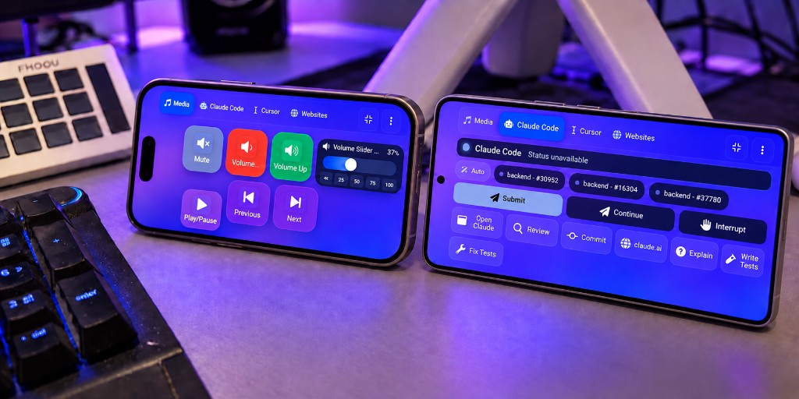

<div align="center">


### Your desktop. On virtual buttons you design.

**A free, open-source virtual stream deck: on-screen buttons you fully customize to your needs, on any screen you already own — and the only one that speaks fluent Claude Code.**

https://github.com/user-attachments/assets/0c438874-2f27-4973-8bab-998fb0ae19a8

**▶ [Download the 1080p tour](docs/assets/vdock-readme.mp4)** · **▶ [Claude Code deep-dive](docs/assets/vdock2-intro.mp4)** — no sound

[](LICENSE)
[](https://github.com/ponya5/VDock2/releases/latest)
[](#quick-start)
[](frontend/)
[](backend/)
[](#contributing)

[Quick start](#quick-start) · [Dashboard](#a-dashboard-you-design) · [Settings](#settings-for-every-detail) · [Mobile](#control-it-from-your-phone) · [Screensaver](#the-screensaver) · [Use cases](#real-use-cases) · [Docs](docs/) · [Issues](https://github.com/ponya5/VDock2/issues)

</div>

---

## Contents

- [What is VDock?](#what-is-vdock)
- [A dashboard you design](#a-dashboard-you-design)
- [Settings for every detail](#settings-for-every-detail)
- [Control it from your phone](#control-it-from-your-phone)
- [The screensaver](#the-screensaver)
- [Why VDock](#why-vdock)
- [Real use cases](#real-use-cases)
- [Quick start](#quick-start)
- [Features](#features)
- [Configuration](#configuration)
- [Troubleshooting](#troubleshooting)
- [Development](#development)
- [Contributing](#contributing)
- [License](#license)

---

## What is VDock?

A traditional stream deck is a box of physical buttons that fire the things you do all day — mute the mic, switch the scene, run the build. The good ones cost £150–£250 and lock you to one vendor's store.

**VDock replaces the box with virtual buttons, in software, for free.** Point any spare screen at it — a £30 USB touch panel, an old tablet, your phone, or just a browser tab — and you get a grid of on-screen buttons you fully customize: what each one does, how it looks, and how many you need.

<div align="center">

<br /><em>A 7-inch panel above the keyboard. No hardware from a vendor, no account, no subscription.</em>
</div>

Out of the box it ships **79 actions** across 11 categories — apps, hotkeys, media, system control, metrics, webhooks, sliders. It then **detects the tools already on your machine** and adds up to **160 more**, so a developer's install ends up with **239 actions** and a designer's install stays lean. Nothing is configured; nothing that can't run is offered.

What makes it different from every other deck is the last part: **VDock was built around AI coding agents.** Claude Code gets 40 actions of its own, a button that shows whether your session is actually alive, and a full-screen alert the moment your agent stops and waits for you.

---

## A dashboard you design


Every scene is a grid you lay out yourself — any size, any mix of buttons, sliders and live widgets. Then make it look the way you want: a **living background** (54 animated options, 5 gradients, or your own image — global, per scene, or per app), **see-through keys** (transparency up to 90%, capped so buttons never disappear), **ten key designs** with 16 overlay effects on top, **smooth virtual sliders** for volume and brightness, and **three dashboard fonts**.


*Same scene, one tap later: every key switched to the Deck Key design.*

### Add any action, anywhere


Tap the pencil and the whole deck opens up: tap an empty cell's **+** to search every action or browse by category, every key gets **remove / edit / duplicate** badges, **drag to reorder** with a mouse or a finger, resize a slider across cells or merge two into one, and set the grid, add pages, or fill the **docked sidebar** with keys that stay put everywhere.

Start from any of the **36 app templates** or import a scene pack someone shared — and every change saves itself.

---

## Settings for every detail


Everything is adjustable, and nothing is guesswork — a **live preview** renders a real key with your current size, labels, touch mode, design and background, and an **in-context grid** shows a whole page before you apply anything.

- **Appearance** — touch mode presets, key size/transparency/design, animations, press sound, dashboard font, docked sidebar, background, and the [screensaver](#the-screensaver)
- **Templates** — one-tap scenes for ChatGPT, Claude, Gemini, Claude Code, Copilot, Cursor, Figma, n8n and more
- **Server** — connection details, ports, how Settings opens
- **Integrations** — detected apps, auto scene switching, the Claude Code attention-alert hook
- **Connect a device** — LAN access and the QR code for your phone, [see below](#control-it-from-your-phone)
- **Logs** — tail backend and frontend logs, export them as a zip


**Find a setting** jumps straight to the right page and control, **Reset section** puts one page back to defaults without touching the rest, and changes **save as you make them** — no Save button to forget.

---

## Control it from your phone

<div align="center">

<br /><em>Media on one phone, Claude Code on another — the same VDock, scanned off the same QR code.</em>
</div>

Any phone or tablet on your Wi-Fi becomes a second deck. No app to install, no account — it's the same VDock, served from your PC, as a **control surface only** (no edit mode, no settings — you can't rearrange your deck from a small screen).

- **A layout built for touch.** A slim scene rail, page steppers, a prominent fullscreen button, and a landscape-only deck that asks you to rotate.
- **A Claude Code console.** A status card shows ready / working / waiting-for-permission, **Submit / Continue / Interrupt** fire into the live terminal, a session picker targets one of several open terminals, and your scene's shortcuts sit underneath.
- **A pocket screensaver** — clock and world clocks, sized for a small screen.


**Connect in three steps:** put the phone on the **same Wi-Fi**, turn on **Settings → Connect a device → Allow LAN access** and relaunch VDock once, then **scan the QR code** (or type the address next to it). LAN access is off by default, the QR encodes nothing but a local address, and on Windows you'll need to allow the firewall prompt for `python.exe` the first time.

---

## The screensaver


Leave the deck idle and it turns into an ambient dashboard: a large **clock**, **weather**, rotating **news** and **sports** headlines from free RSS feeds, live **stock/crypto** quotes, and **world clocks** — all with **no API keys required**.

Or pick the **music visualizer** — 16 animated spectrum skins, from classic Winamp bars to 3D wave grids and a neon fly-through, reacting to whatever's playing on the PC. Shuffle mode crossfades between skins on a timer, and you can layer the widgets on top.


Toggle each widget and open its **Options** for feeds, tickers or cities; **Customise layout** opens a live drag-and-resize editor with snap guides; an idle delay from off to 10 minutes has its own **Test** button; and it gets its own background and a text size from 80–250%. If Claude Code needs you while it's up, the amber attention alert appears on top of it.

---

## Why VDock

|  | VDock | Elgato Virtual SD | Touch Portal | WebDeck |
|---|---|---|---|---|
| **Price** | Free, MIT | Free **only if** you own Elgato hardware | Free tier 4×2/2 pages; Pro $13.99 | Free, GPLv3 |
| **Host OS** | Windows · macOS · Linux | Windows · macOS | Windows · macOS | **Windows only** |
| **AI agent actions** | **Claude Code (40), Copilot, Cursor, Devin, VS Code, JetBrains** | — | — | — |
| **Agent-waiting alerts** | **Yes** | — | — | — |
| **Ambient dashboard when idle** | **Yes** | — | — | — |
| **Plugin marketplace** | Templates + scene packs | Large | **Largest** | Small |

**In one line:** free, agent-native, ambient, and yours.

---

## Real use cases

**1. Driving an AI coding agent without leaving the keyboard.** Tap **Review** and `/code-review` lands in your live Claude Code session — not a new one. The green dot on the scene tab confirms VDock can see the process, and an **agent attention alert** raises a pulsing amber card over everything (including the screensaver) the moment Claude stops to ask you something.


**2. A second screen that earns its desk space.** Idle, it's an ambient dashboard — clock, weather, headlines, markets. [More on the screensaver.](#the-screensaver)

**3. Calls and recording.** Mute, camera, push-to-talk (fire on press, a different action on release), OBS scene switching, and a **volume slider you drag** rather than a button you tap eleven times.

**4. Anything with an HTTP endpoint.** One `http_request` action covers Home Assistant, n8n, Zapier, Discord webhooks, your own CI — and can show a value from the response on the button face.

**5. A phone as a spare deck.** Scan the QR code and it's a second deck — mute from across the room, or drive Claude Code from the couch. [How it works.](#control-it-from-your-phone)

**6. A kiosk or workshop panel.** Tablet touch mode, 44px minimum targets, and a first-run tour mean you can hand a panel to someone who has never seen it.

<details>
<summary><strong>Using a touchscreen as a second monitor (Windows)</strong> — fixing touch landing on the wrong screen</summary>

Windows will often route every tap to your *primary* display instead of a spare touchscreen monitor. Fix it in two steps:

1. Open **Tablet PC Settings** (Start menu search) → **Display** → **Setup**, then tap the touchscreen monitor when prompted.
2. If that doesn't stick, run Windows' own built-in digitizer-to-monitor mapping tool from a Command Prompt: `multidigimon -touch` (`MultiDigiMon.exe` ships with Windows in `System32` — run as Administrator if it appears to do nothing).

</details>

---

## Quick start

### 1. Get VDock

**Easiest — install the app.** Download the installer for your OS from the [latest release](https://github.com/ponya5/VDock2/releases/latest) (`VDock Setup x.y.z.exe` on Windows, `VDock-x.y.z-arm64.dmg` on macOS, `.AppImage`/`.deb` on Linux) and run it. The builds aren't code-signed yet, so your OS warns once — Windows SmartScreen → **More info → Run anyway**; macOS → right-click → **Open**.

**Or from source** — needs [Python 3.9+](https://www.python.org/downloads/) (tick "Add Python to PATH" on Windows) and [Node.js 18+](https://nodejs.org/):

```bash
git clone https://github.com/ponya5/VDock2.git
cd VDock2
```

- **Windows:** double-click **`setup.bat`** → choose **[1] Full setup**
- **macOS / Linux:** `chmod +x setup.sh launch.sh && ./setup.sh`

Setup installs dependencies and puts a **VDock icon on your desktop**.

### 2. Launch it

**Double-click the VDock icon on your desktop** — that's it, every day. (Or run `launch.bat` / `./launch.sh`.) It opens at `http://localhost:3000` after a few seconds, walks you through a short tour, and drops you into working **Media** and **Claude Code** scenes — no configuration needed.

**Optional tools** — none required, they unlock extra actions and stay greyed out with the reason shown until installed: [Claude Code](https://claude.com/product/claude-code) → 40 Claude actions · [GitHub CLI](https://cli.github.com) → PRs, issues, CI · Git → repo-aware actions.

**Uninstall:** installed app → remove it like any app (your profiles are kept). Source checkout → `uninstall.bat` / `./uninstall.sh`, then delete the folder.

---

## Features


**The deck:** scenes & pages with 6 transitions and auto-switch to the focused app, macros, two-state toggles synced across every open window, press-vs-release triggers (push-to-talk from a button), and a quick-deck overlay (`` ` `` in the window, `Ctrl+Shift+D` globally).

**Integrations:** **Claude Code** (prompts, slash commands, session resume/rewind/compact, approve/deny, transcript — using your existing login), **GitHub** (`gh`-powered PRs/issues/checks plus live badges), **Cursor · Copilot · VS Code · JetBrains · Visual Studio · Devin** (102 more commands), **OBS** (scenes, sources, streaming), and **HTTP/webhooks** (any REST endpoint, response value on the button). Keystroke actions only fire when the target editor is actually focused — deliberate, so keys never land in the wrong window.

<table>
<tr>
<td width="50%"></td>
<td width="50%"></td>
</tr>
<tr>
<td align="center"><sub>Pick a key design from live swatches</sub></td>
<td align="center"><sub>Translucent keys over an animated background</sub></td>
</tr>
</table>

---

## Configuration

Almost everything you'd change lives in **Settings** — searchable, autosaving. The rest: server config in `backend/data/config.json` (created on first run, gitignored), secrets in `backend/.env` (copy from `backend/.env.example`), and ports via `setup.bat --ports` / `./setup.sh` option 4.

Secrets never reach the frontend — the action list exposes only *whether* an integration is configured, and secrets are stripped from command output before it reaches a notification or a log.

---

## Troubleshooting

- **Python/Node not found** — reinstall with PATH enabled, restart the terminal
- **Port 3000 or 5000 in use** — change ports in setup, or close the other process
- **Setup failed on npm** — delete `frontend/node_modules`, run setup option **2** again
- **Desktop window doesn't open** — open **http://localhost:3000** in a browser
- **macOS blocks the launcher** — right-click `VDock.command` → **Open**, first time only
- **Claude / GitHub buttons greyed out** — hover for the reason, usually the CLI isn't installed or `gh auth login` hasn't run
- **Keystroke actions do nothing** — they only fire when the target editor is focused; deliberate
- **Phone can't reach VDock** — **Settings → Connect a device**: allow LAN access, relaunch, allow the Windows firewall prompt for `python.exe`, check both devices are on the same Wi-Fi
- **Touch lands on the wrong monitor** — see [Using a touchscreen as a second monitor](#real-use-cases), a Windows display-mapping issue, not a VDock bug
- **UI looks like an old build** — it self-heals on reload; if not, hard-refresh once
- **Something else** — **Settings → Logs**, tail or export the backend/frontend logs with your issue

---

## Development

```bash
# Backend
cd backend
python -m venv venv
source venv/bin/activate         # Windows: venv\Scripts\activate
pip install -r requirements.txt
python app.py

# Frontend (second terminal)
cd frontend
npm install
npm run dev
```

```bash
# Tests
cd backend && pip install -r requirements-dev.txt && pytest
cd frontend && npm test
```

**Architecture:** Vue 3 + TypeScript front end, Python Flask + Socket.IO back end, Electron shell for the desktop build. Actions live in a catalog the frontend reads at runtime; integrations are self-detecting plugin packs under `backend/integrations/`.

Every change is written up in **[`design-log/`](design-log/)** — one numbered entry with the problem, the design, and how it was verified. [`docs/development/DEVELOPER_GUIDE.md`](docs/development/DEVELOPER_GUIDE.md) covers adding an action type or writing an integration pack.

```
VDock2/
├── setup.bat / setup.sh      ← interactive installer
├── launch.bat / launch.sh    ← daily launcher
├── backend/                  ← Flask API, actions, integration packs
├── frontend/                 ← Vue 3 + TypeScript UI
│   └── electron/             ← desktop shell
├── design-log/               ← numbered design decisions
└── docs/                     ← guides and assets
```

---

## Contributing

Issues and pull requests are welcome — fork, branch, PR. Good first contributions: a new integration pack, an app template, a background, or a bug fix. Full guide: [CONTRIBUTING.md](docs/CONTRIBUTING.md); by participating you agree to the [Code of Conduct](docs/CODE_OF_CONDUCT.md).

If you're reporting a bug, **Settings → Logs → Export** gives you a zip worth attaching. Security issues: report privately per [SECURITY.md](SECURITY.md) — a [GitHub security advisory](https://github.com/ponya5/VDock2/security/advisories) or ponya81@gmail.com — rather than a public issue.

---

## License

MIT — see [LICENSE](LICENSE). Use it, fork it, ship it.

<div align="center">
<br />

**VDock2** · built by [Daniel Shalom (@ponya5)](https://github.com/ponya5)

If it saved you a click today, a ⭐ helps other people find it.

</div>
