<div align="center">

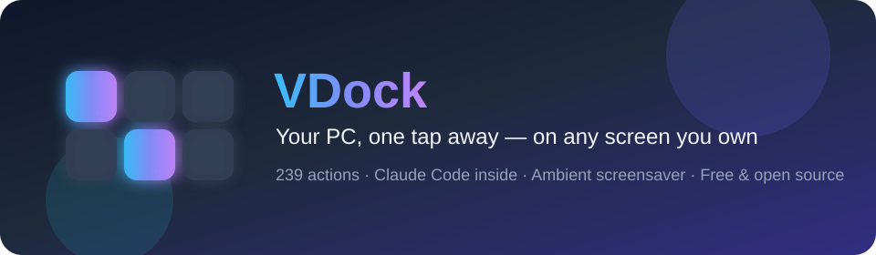

### Your desktop. On virtual buttons you design.

**A free, open-source virtual stream deck: on-screen buttons you fully customize to your needs, on any screen you already own — and the only one that speaks fluent Claude Code.**

https://github.com/user-attachments/assets/0c438874-2f27-4973-8bab-998fb0ae19a8

**▶ [Download the 1080p tour](docs/assets/vdock-readme.mp4)** · **▶ [Claude Code deep-dive](docs/assets/vdock2-intro.mp4)** — no sound

[](LICENSE)
[](https://github.com/ponya5/VDock2/releases/latest)
[](#quick-start)
[](frontend/)
[](backend/)
[](#contributing)

[Quick start](#quick-start) · [Dashboard](#a-dashboard-you-design) · [Settings](#settings-for-every-detail) · [Agents](#built-for-ai-coding-agents) · [Phone & tablet](#phone-and-tablet-as-the-touch-screen) · [Screensaver](#the-screensaver) · [Docs](docs/) · [Issues](https://github.com/ponya5/VDock2/issues)

</div>

---

## What is VDock?

A traditional stream deck is a box of physical buttons that fire the things you do all day — mute the mic, switch the scene, run the build. The good ones cost £150–£250 and lock you to one vendor's store.

**VDock replaces the box with virtual buttons, in software, for free.** Point any spare screen at it — a £30 USB touch panel, an old tablet, your phone, or just a browser tab — and you get a grid of on-screen buttons you fully customize: what each one does, how it looks, and how many you need.

<div align="center">

<br /><em>A 7-inch panel above the keyboard. No hardware from a vendor, no account, no subscription.</em>
</div>

Out of the box it ships **79 actions** across 11 categories — apps, hotkeys, media, system control, metrics, webhooks, sliders. It then **detects the tools already on your machine** and adds up to **160 more**, so a developer's install ends up with **239 actions** and a designer's install stays lean. Nothing is configured; nothing that can't run is offered.

What makes it different from every other deck is the last part: **VDock was built around AI coding agents.** Claude Code gets 40 actions of its own, a button that shows whether your session is actually alive, and a full-screen alert the moment your agent stops and waits for you.

---

## A dashboard you design


Every scene is a grid you lay out yourself — any size, any mix of buttons, sliders and live widgets. Then make it look the way you want: a **living background** (54 animated options, 5 gradients, or your own image — global, per scene, or per app), **see-through keys** (transparency up to 90%, capped so buttons never disappear), **ten key designs** with 16 overlay effects on top, **smooth virtual sliders** for volume and brightness, and **three dashboard fonts**.


*Same scene, one tap later: every key switched to the Deck Key design.*

### Add any action, anywhere


Tap the pencil and the whole deck opens up: tap an empty cell's **+** to search every action or browse by category, every key gets **remove / edit / duplicate** badges, **drag to reorder** with a mouse or a finger, resize a slider across cells or merge two into one, and set the grid, add pages, or fill the **docked sidebar** with keys that stay put everywhere.

Start from any of the **36 app templates** or import a scene pack someone shared — and every change saves itself.

---

## Built for AI coding agents

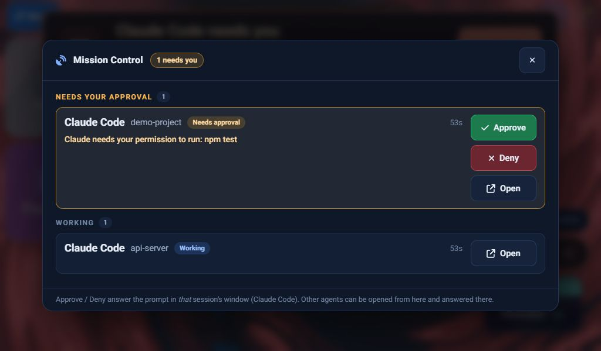

**Mission Control** lists every agent session — which one needs you, which is working — and lets you approve, deny or jump into it. When an agent stops to ask, a **branded alert** (Claude, Cursor, Copilot, Devin…) rises over the deck and the screensaver.

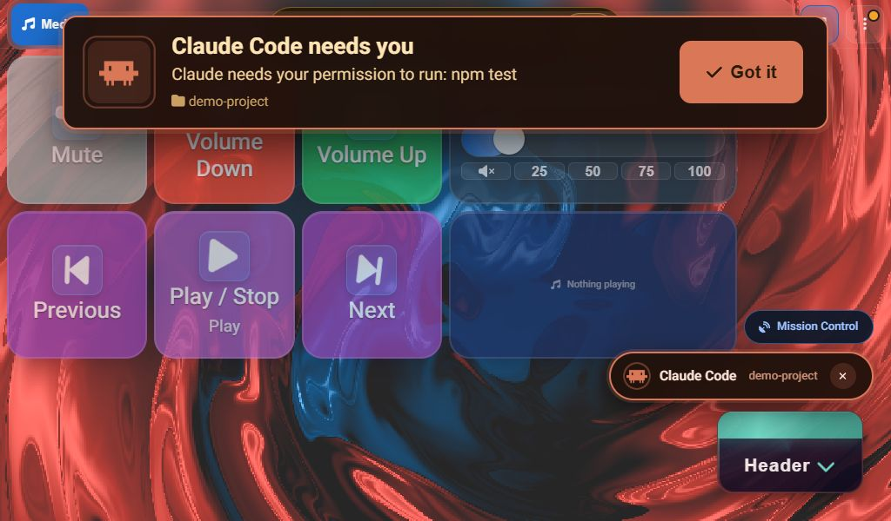

New in 2.3, each a button you can add from the action picker:

- **Agent Prompt** — send a preset (Continue, Write tests…) or your own text to the ready session
- **Review Changes** — the files the agent changed this turn; tap one for its diff
- **Run Tests** — detects your repo's test command and shows pass / fail
- **Agent Usage** — today's estimated spend and tokens, as a chip
- **Git Branch**, **Dev Servers**, **Docker** — live status faces with a tap menu (pull/push/stash, open/restart/stop, start/stop/logs)
- **Mic Mute** — a real Windows microphone mute with a LIVE / MUTED face
- **Dictate to Agent** — hold to speak via Windows voice typing, release, review, then submit yourself

Keystroke actions only fire when the target app is focused.

---

## Settings for every detail

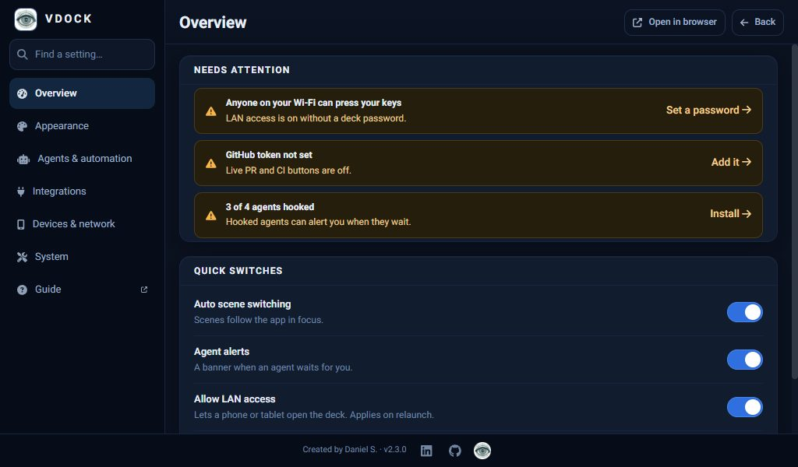

Settings opens on **Overview**: what's set up, what needs you, and the switches you reach for most. Five sections sit underneath:

- **Appearance** — key size, transparency and design, backgrounds, fonts, docked sidebar, the [screensaver](#the-screensaver)
- **Agents & automation** — agent alerts and hooks, auto scene switching, triggers, the MCP server
- **Integrations** — **Accounts & keys** and one-tap app templates (ChatGPT, Claude, Cursor, Figma, n8n…)
- **Devices & network** — Connect a device, deck password, ports and host
- **System** — logs (exportable), startup, About

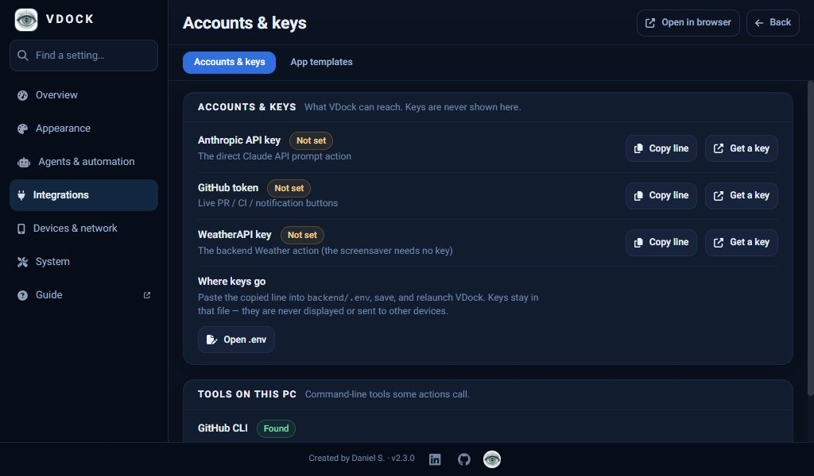

**Accounts & keys** shows which keys and CLIs are configured and what each unlocks. Keys are never shown, typed into the app, or sent to other devices — you copy the line and paste it into the `.env` file. **Find a setting** jumps to any control, **Reset section** restores one page, and changes **save as you make them**.

---

## Phone and tablet as the touch screen

<table>
<tr>
<td width="32%">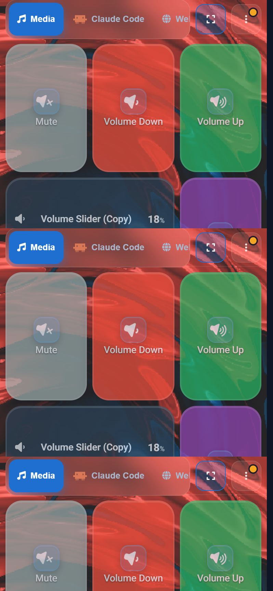</td>
<td width="68%">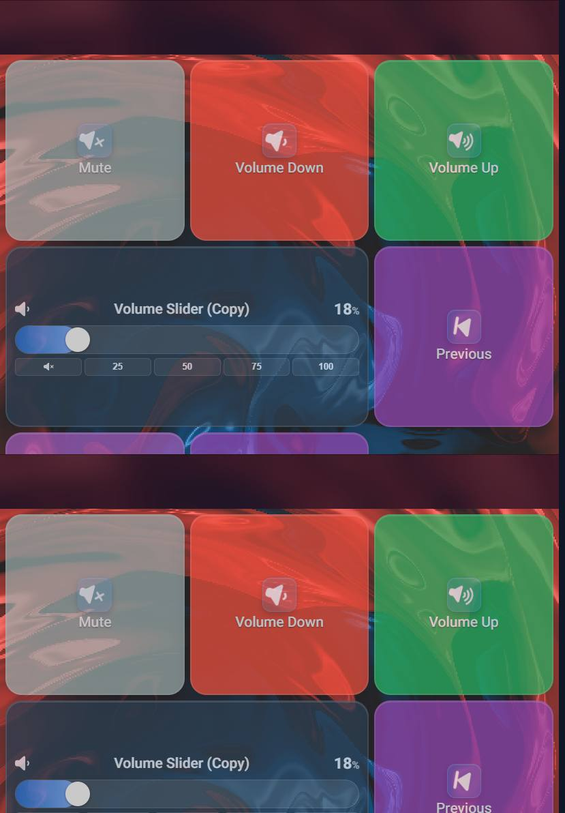</td>
</tr>
<tr>
<td align="center"><sub>Phone, portrait</sub></td>
<td align="center"><sub>Tablet, portrait (820×1180)</sub></td>
</tr>
</table>

Any phone or tablet on your Wi-Fi becomes a deck. No app store, no account — it's the same VDock, served from your PC.

- **Phone = a remote.** Portrait layout, safe-area aware, with a Claude Code console and a **phone approval remote**: Approve / Deny a waiting agent from the couch.
- **Tablet = a full deck.** Portrait and landscape grids that fit the screen, with [edit mode](docs/assets/screens/tablet-edit.jpg) (rearrange keys on the tablet itself), and the screen stays awake while the deck is open.
- **Stays connected.** A reconnect banner appears only if the PC is really unreachable, the deck resumes on the right scene when the phone wakes, and edits on one device show up on the others.
- **Install as an app.** Add it to the Home Screen for a full-screen deck with no browser bars.

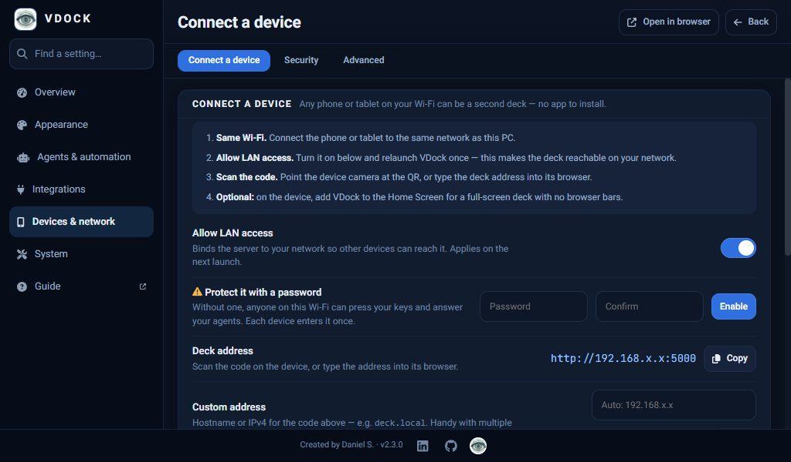

**Connect in three steps:** same **Wi-Fi**; **Settings → Devices & network → Connect a device**, turn on **Allow LAN access** and relaunch once; **scan the QR code**. With a deck password set, the QR carries a single-use pairing token (10 minutes), so the phone signs in by scanning.

> **Security:** LAN access is off by default. Anyone on your Wi-Fi who can reach the deck can press your keys and answer your agents, so **set a deck password before turning on LAN access** (Connect page, same screen). Allow the Windows firewall prompt for `python.exe` the first time. See [SECURITY.md](SECURITY.md).

---

## The screensaver

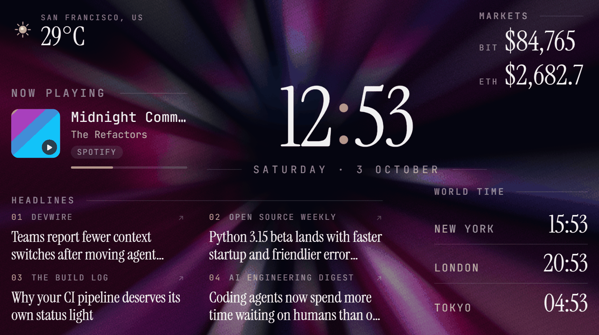

Leave the deck idle and it turns into an ambient dashboard: a large **clock**, **weather**, rotating **news** and **sports** headlines from free RSS feeds, live **stock/crypto** quotes, and **world clocks** — all with **no API keys required**.

Or pick the **music visualizer** — 16 animated spectrum skins, from classic Winamp bars to 3D wave grids and a neon fly-through, reacting to whatever's playing on the PC. Shuffle mode crossfades between skins on a timer, and you can layer the widgets on top.

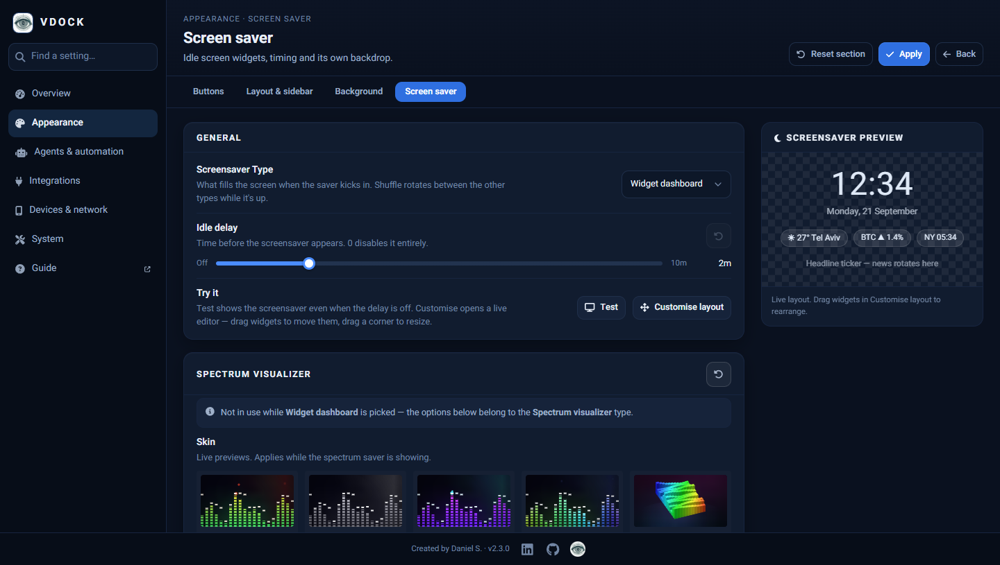

Toggle each widget and open its **Options** for feeds, tickers or cities; **Customise layout** opens a live drag-and-resize editor with snap guides; an idle delay from off to 10 minutes has its own **Test** button; and it gets its own background and a text size from 80–250%. If Claude Code needs you while it's up, the amber attention alert appears on top of it.

---

## Why VDock

Free and MIT (Elgato's virtual deck needs their hardware; Touch Portal's free tier is capped), runs on **Windows, macOS and Linux**, and is the only deck with **agent-native actions and agent-waiting alerts** — Claude Code, Copilot, Cursor, Devin, VS Code and JetBrains — plus an ambient dashboard when idle. Plugin-style extras come as templates and scene packs.

---

## Real use cases

- **Driving an AI agent from the deck.** Tap **Review** and `/code-review` lands in your live Claude Code session — not a new one. A green dot on the scene tab confirms VDock sees the process, and an alert rises the moment the agent waits for you.
- **A second screen that earns its desk space.** Idle, it's an [ambient dashboard](#the-screensaver).
- **Calls and recording.** Mute (a real mic mute), camera, push-to-talk (one action on press, another on release), OBS scene switching, and a volume slider you drag.
- **Anything with an HTTP endpoint.** One `http_request` action covers Home Assistant, n8n, Zapier and webhooks, and can show a response value on the key.
- **A kiosk or workshop panel.** Touch presets, 44px minimum targets and a first-run tour.

<details>
<summary><strong>Using a touchscreen as a second monitor (Windows)</strong> — fixing touch landing on the wrong screen</summary>

Windows will often route every tap to your *primary* display instead of a spare touchscreen monitor. Fix it in two steps:

1. Open **Tablet PC Settings** (Start menu search) → **Display** → **Setup**, then tap the touchscreen monitor when prompted.
2. If that doesn't stick, run Windows' own built-in digitizer-to-monitor mapping tool from a Command Prompt: `multidigimon -touch` (`MultiDigiMon.exe` ships with Windows in `System32` — run as Administrator if it appears to do nothing).

</details>

---

## Quick start

### 1. Get VDock

**Easiest — install the app.** Download the installer for your OS from the [latest release](https://github.com/ponya5/VDock2/releases/latest) (`VDock Setup x.y.z.exe` on Windows, `VDock-x.y.z-arm64.dmg` on macOS, `.AppImage`/`.deb` on Linux) and run it. The builds aren't code-signed yet, so your OS warns once — Windows SmartScreen → **More info → Run anyway**; macOS → right-click → **Open**.

**Or from source** — needs [Python 3.9+](https://www.python.org/downloads/) (tick "Add Python to PATH" on Windows) and [Node.js 20+](https://nodejs.org/):

```bash
git clone https://github.com/ponya5/VDock2.git
cd VDock2
```

- **Windows:** double-click **`setup.bat`** → choose **[1] Full setup**
- **macOS / Linux:** `chmod +x setup.sh launch.sh && ./setup.sh`

Setup installs dependencies and puts a **VDock icon on your desktop**.

### 2. Launch it

**Double-click the VDock icon on your desktop** — that's it, every day. (Or run `launch.bat` / `./launch.sh`.) It opens at `http://localhost:3000` after a few seconds, walks you through a short tour, and drops you into working **Media** and **Claude Code** scenes — no configuration needed.

**Optional tools** — none required, they unlock extra actions and stay greyed out with the reason shown until installed: [Claude Code](https://claude.com/product/claude-code) → 40 Claude actions · [GitHub CLI](https://cli.github.com) → PRs, issues, CI · Git → repo-aware actions.

**Uninstall:** installed app → remove it like any app (your profiles are kept). Source checkout → `uninstall.bat` / `./uninstall.sh`, then delete the folder.

---

## Features

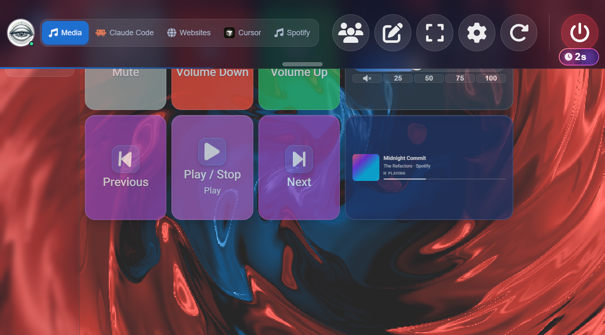

**The deck:** scenes & pages with 6 transitions and auto-switch to the focused app, macros, two-state toggles synced across every open window, press-vs-release triggers (push-to-talk from a button), and a quick-deck overlay (`` ` `` in the window, `Ctrl+Shift+D` globally).

**Integrations:** **Claude Code** (prompts, slash commands, session resume/rewind/compact, approve/deny, transcript — using your existing login), **GitHub** (`gh`-powered PRs/issues/checks plus live badges), **Cursor · Copilot · VS Code · JetBrains · Visual Studio · Devin** (102 more commands), **OBS** (scenes, sources, streaming), and **HTTP/webhooks** (any REST endpoint, response value on the button). Keystroke actions only fire when the target editor is actually focused — deliberate, so keys never land in the wrong window.

---

## Configuration

Almost everything lives in **Settings** — searchable, autosaving. Server config is `backend/data/config.json` (created on first run, gitignored); ports via `setup.bat --ports` / `./setup.sh` option 4. Environment settings go in `.env` files copied from the committed templates — never commit the real ones:

| File | Template | What goes there |
|---|---|---|
| `backend/.env` (installed app: `<data dir>/.env`) | [`backend/.env.example`](backend/.env.example) | `SECRET_KEY` (generated on first run), `HOST`/`PORT`, `ALLOW_LAN`, `REQUIRE_AUTH`/`AUTH_PASSWORD`, `USE_SSL`, `DATA_DIR`, rate limits, and integration keys `ANTHROPIC_API_KEY`, `GITHUB_TOKEN`, `WEATHERAPI_KEY` |
| `frontend/.env` | [`frontend/.env.example`](frontend/.env.example) | `VITE_PORT`, `VITE_BACKEND_PORT`, `VITE_WS_URL` (dev server only) |

Secrets never reach the frontend — Settings shows only *whether* a key is set, and they're stripped from command output before any notification or log. Startup refuses unsafe combinations (debug mode on the network, SSL without certificates, an example password).

---

## Troubleshooting

- **Python/Node not found** — reinstall with PATH enabled, restart the terminal
- **Port 3000 or 5000 in use** — change ports in setup, or close the other process
- **Setup failed on npm** — delete `frontend/node_modules`, run setup option **2** again
- **Desktop window doesn't open** — open **http://localhost:3000** in a browser
- **macOS blocks the launcher** — right-click `VDock.command` → **Open**, first time only
- **Claude / GitHub buttons greyed out** — hover for the reason, usually the CLI isn't installed or `gh auth login` hasn't run
- **Keystroke actions do nothing** — they only fire when the target editor is focused; deliberate
- **Phone can't reach VDock** — **Settings → Devices & network → Connect a device**: allow LAN access, relaunch, allow the Windows firewall prompt for `python.exe`, check both devices are on the same Wi-Fi
- **Touch lands on the wrong monitor** — see [Using a touchscreen as a second monitor](#real-use-cases), a Windows display-mapping issue, not a VDock bug
- **UI looks like an old build** — it self-heals on reload; if not, hard-refresh once
- **Something else** — **Settings → Logs**, tail or export the backend/frontend logs with your issue

---

## Development

```bash
# Backend
cd backend
python -m venv venv
source venv/bin/activate         # Windows: venv\Scripts\activate
pip install -r requirements.txt
python app.py

# Frontend (second terminal)
cd frontend
npm install
npm run dev
```

```bash
# Tests — or run everything CI runs: scripts/check.ps1 (Windows) / scripts/check.sh
cd backend && pip install -r requirements-dev.txt && pytest
cd frontend && npm test
```

**Architecture:** Vue 3 + TypeScript front end, Python Flask + Socket.IO back end, Electron shell for the desktop build. Actions live in a catalog the frontend reads at runtime; integrations are self-detecting plugin packs under `backend/integrations/`.

Every change is written up in **[`design-log/`](design-log/)** — one numbered entry with the problem, the design, and how it was verified. [`docs/development/DEVELOPER_GUIDE.md`](docs/development/DEVELOPER_GUIDE.md) covers adding an action type or writing an integration pack.

Layout: `backend/` (Flask API, actions, integration packs) · `frontend/` (Vue UI, `electron/` shell) · `scripts/` · `design-log/` · `docs/`. `frontend/dist` is a local build output (gitignored) that Flask serves — run `npm run build` after UI changes.

---

## Contributing

Issues and pull requests are welcome — fork, branch, PR. Good first contributions: a new integration pack, an app template, a background, or a bug fix. Full guide: [CONTRIBUTING.md](docs/CONTRIBUTING.md); by participating you agree to the [Code of Conduct](docs/CODE_OF_CONDUCT.md).

If you're reporting a bug, **Settings → Logs → Export** gives you a zip worth attaching. Security issues: report privately per [SECURITY.md](SECURITY.md) — a [GitHub security advisory](https://github.com/ponya5/VDock2/security/advisories) or ponya81@gmail.com — rather than a public issue.

---

## License

MIT — see [LICENSE](LICENSE). Use it, fork it, ship it.

<div align="center">
<br />

**VDock** · built by [Daniel Shalom (@ponya5)](https://github.com/ponya5)

If it saved you a click today, a ⭐ helps other people find it.

</div>
