# VDock Architecture Documentation

## Overview

VDock is a virtual stream deck application built with a modern, modular architecture that supports both web and desktop deployment. The system is designed for scalability, maintainability, and cross-platform compatibility.

## System Architecture

### High-Level Architecture

```mermaid
graph TB
    subgraph "Client Layer"
        Web[Web Browser]
        Desktop[Desktop App]
        Mobile[Mobile App]
    end
    
    subgraph "Frontend Layer"
        Vue[Vue.js SPA]
        Electron[Electron Wrapper]
        PWA[PWA Support]
    end
    
    subgraph "API Layer"
        REST[REST API]
        WS[WebSocket]
        Auth[Authentication]
    end
    
    subgraph "Backend Layer"
        Flask[Flask Application]
        Routes[Route Modules]
        Actions[Action System]
        Plugins[Plugin System]
    end
    
    subgraph "Data Layer"
        Files[File System]
        Profiles[Profile Storage]
        Config[Configuration]
        Logs[Logging]
    end
    
    subgraph "External Services"
        Spotify[Spotify API]
        OBS[OBS Studio]
        System[System APIs]
    end
    
    Web --> Vue
    Desktop --> Electron
    Mobile --> PWA
    
    Vue --> REST
    Vue --> WS
    Electron --> REST
    Electron --> WS
    
    REST --> Flask
    WS --> Flask
    Auth --> Flask
    
    Flask --> Routes
    Routes --> Actions
    Routes --> Plugins
    
    Actions --> Files
    Plugins --> External Services
    
    Files --> Profiles
    Files --> Config
    Files --> Logs
```

## Component Architecture

### Frontend Architecture

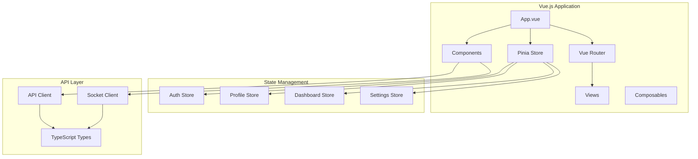

### Backend Architecture

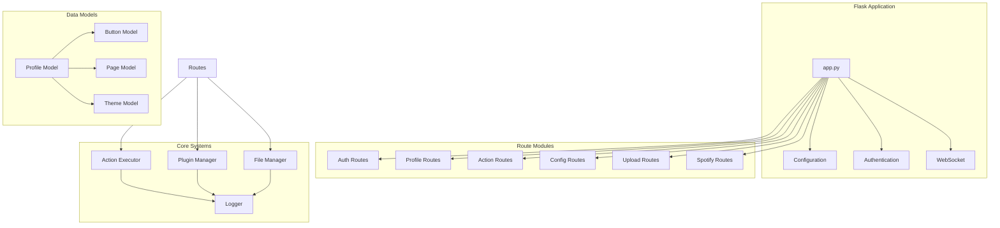

## Data Flow Architecture

### User Interaction Flow

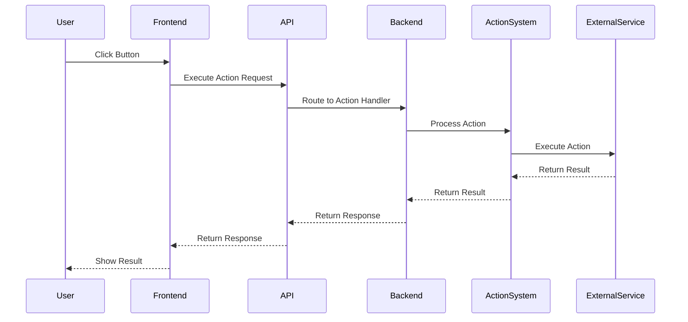

### Profile Management Flow

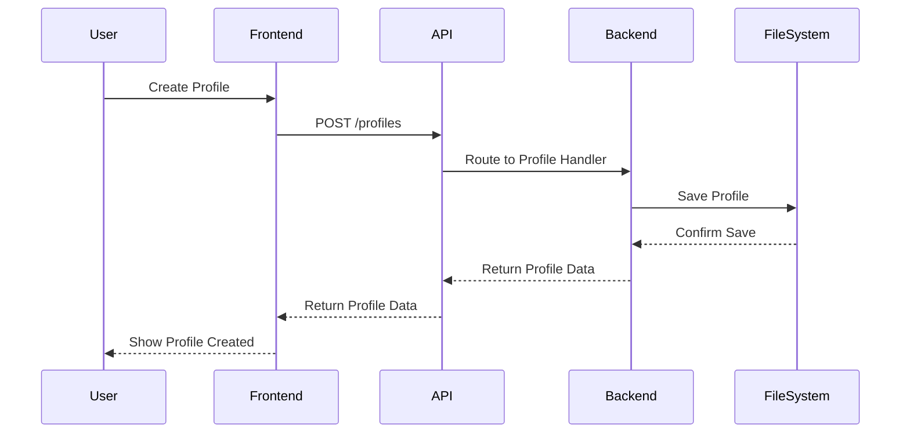

## Technology Stack

### Frontend Technologies

- **Vue.js 3**: Progressive JavaScript framework
- **TypeScript**: Type-safe JavaScript
- **Pinia**: State management library
- **Vue Router**: Client-side routing
- **Vite**: Build tool and development server
- **Electron**: Desktop application wrapper
- **PWA**: Progressive Web App capabilities

### Backend Technologies

- **Python 3.8+**: Programming language
- **Flask**: Web framework
- **Flask-SocketIO**: WebSocket support
- **Flask-CORS**: Cross-origin resource sharing
- **PyJWT**: JSON Web Token handling
- **Pillow**: Image processing
- **Requests**: HTTP library

### Development Tools

- **Docker**: Containerization
- **Docker Compose**: Multi-container orchestration
- **Nginx**: Reverse proxy and static file serving
- **Git**: Version control
- **ESLint**: Code linting
- **Prettier**: Code formatting

## Security Architecture

### Authentication Flow

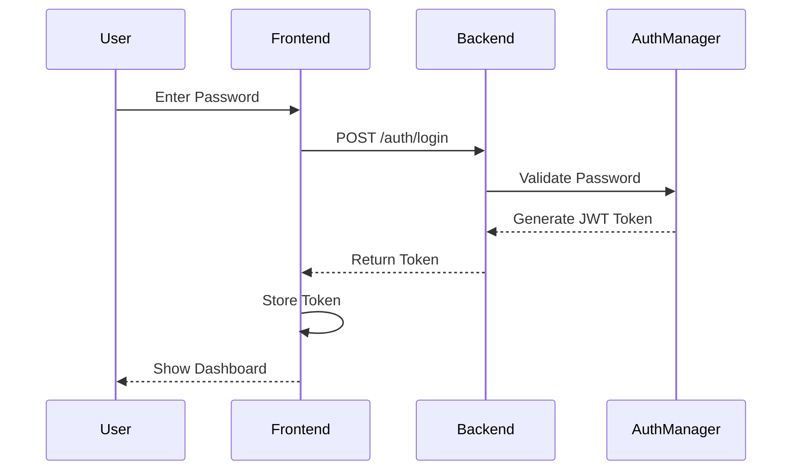

### Security Layers

1. **Authentication**: JWT-based token authentication
2. **Authorization**: Role-based access control
3. **Input Validation**: Server-side validation
4. **CORS**: Cross-origin request protection
5. **HTTPS**: Encrypted communication
6. **Rate Limiting**: Request throttling
7. **File Validation**: Upload security

## Plugin Architecture

### Plugin System Design

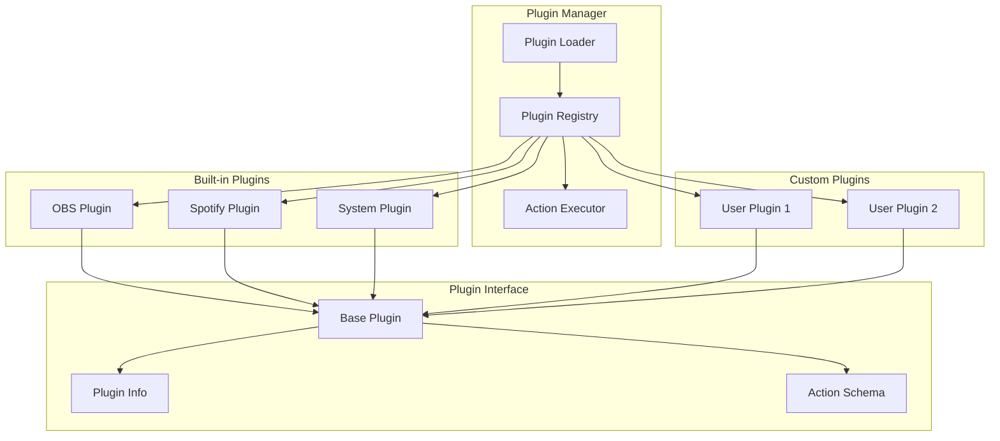

## Deployment Architecture

### Production Deployment

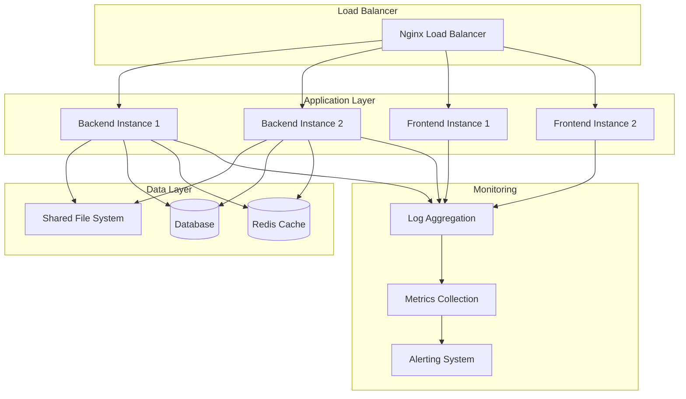

### Docker Architecture

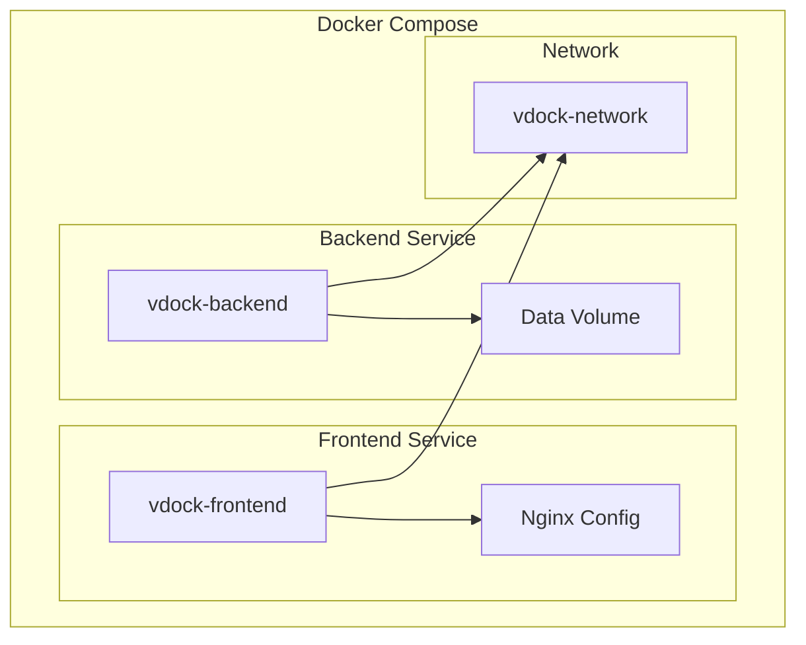

## Performance Architecture

### Caching Strategy

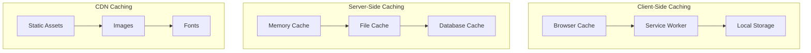

### Optimization Strategies

1. **Frontend Optimization**
   - Code splitting and lazy loading
   - Image optimization and compression
   - Bundle size optimization
   - Service worker caching

2. **Backend Optimization**
   - Database query optimization
   - Connection pooling
   - Response compression
   - Caching strategies

3. **Network Optimization**
   - CDN for static assets
   - HTTP/2 support
   - Compression (gzip/brotli)
   - Keep-alive connections

## Scalability Architecture

### Horizontal Scaling

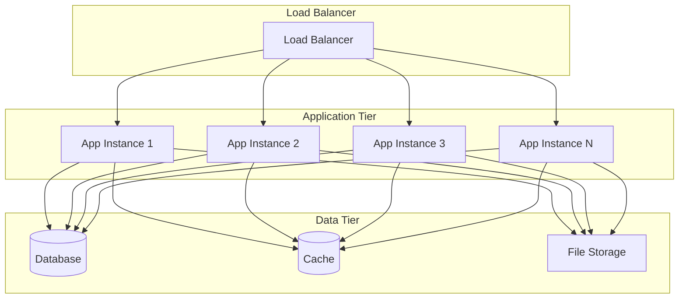

### Vertical Scaling

1. **Resource Optimization**
   - CPU optimization
   - Memory management
   - Storage optimization
   - Network optimization

2. **Performance Monitoring**
   - Application metrics
   - System metrics
   - User experience metrics
   - Business metrics

## Monitoring Architecture

### Observability Stack

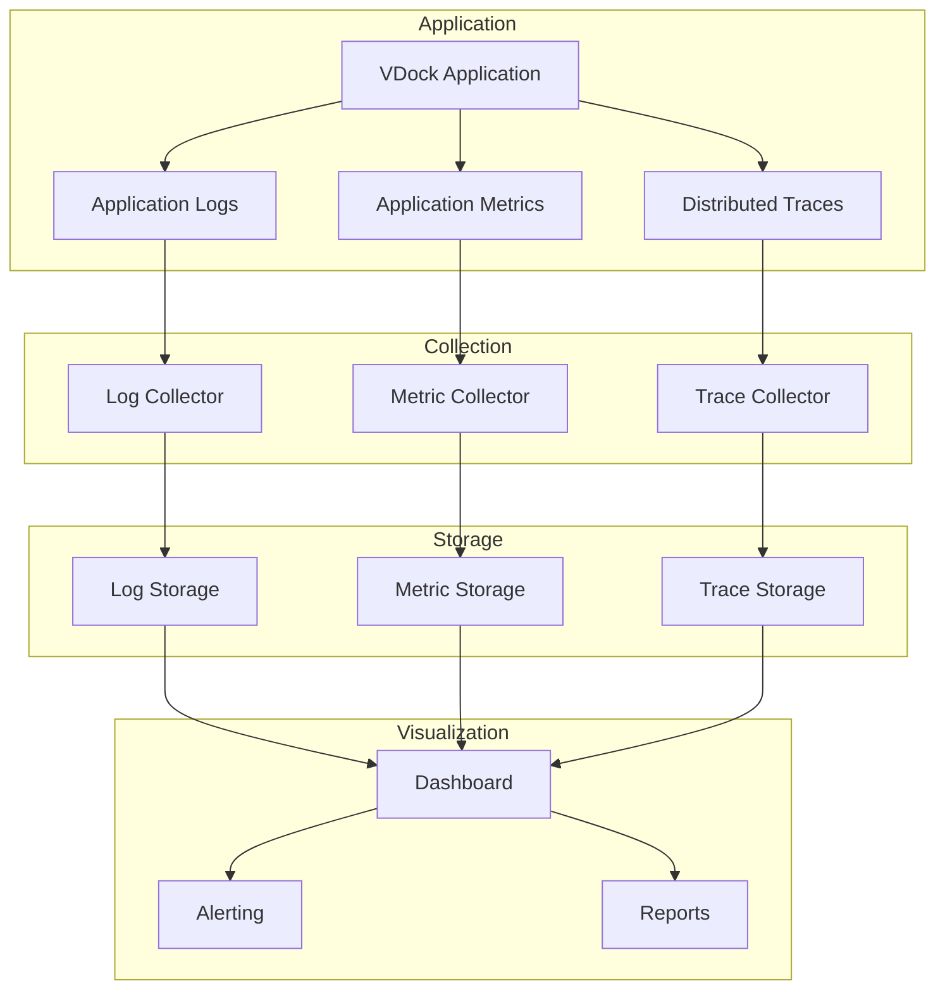

## Future Architecture Considerations

### Planned Enhancements

1. **Microservices Architecture**
   - Service decomposition
   - API gateway
   - Service mesh
   - Event-driven architecture

2. **Cloud-Native Architecture**
   - Kubernetes deployment
   - Cloud storage integration
   - Serverless functions
   - Edge computing

3. **Advanced Features**
   - Real-time collaboration
   - AI-powered suggestions
   - Advanced analytics
   - Mobile applications

### Architecture Evolution

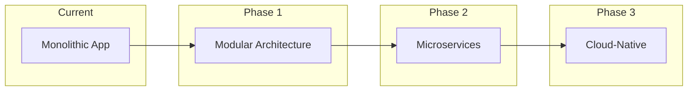

## Conclusion

VDock's architecture is designed for:

- **Scalability**: Horizontal and vertical scaling capabilities
- **Maintainability**: Modular design with clear separation of concerns
- **Security**: Multi-layered security architecture
- **Performance**: Optimized for speed and efficiency
- **Flexibility**: Plugin system for extensibility
- **Reliability**: Robust error handling and monitoring

The architecture supports both current needs and future growth, with clear paths for evolution and enhancement.

---

**Last Updated**: 2024-01-01  
**Version**: 1.0.0  
**Maintainer**: VDock Architecture Team
